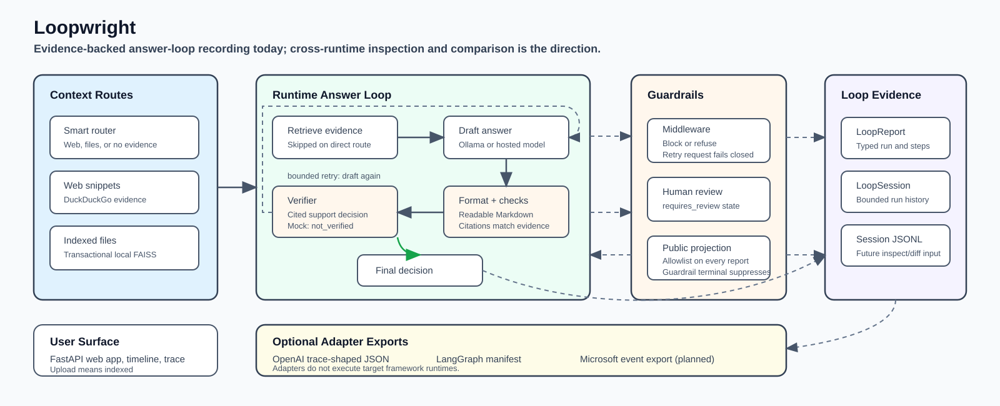

# Loopwright
Loopwright is a flight recorder for AI agent loops. It inspects and hardens
context selection, retrieval, drafting, format checks, citation checks, claim
verification, retries, refusals, middleware guardrails, evals, and replay. The
current built-in evidence sources are Smart Evidence routing, DuckDuckGo web
snippets, optional uploaded files, thread memory, and direct model knowledge.
The product focus is trust: making agent behavior visible, testable, and harder
to fake.

## Features
- **Loop Engineering Core:** Treats retrieval, drafting, format checks, self-checking, retry, refusal, middleware guardrails, and evals as the product surface rather than hidden plumbing
- **Observable Runtime Reports:** Emits structured loop evidence for context selection, prompt evidence, drafts, format checks, verifier decisions, retries, refusals, and replay
- **Durable Local Runs:** Stores public loop-run summaries and reports in the
  local thread database so completed runs remain inspectable after restart
- **Visible Thread Memory:** Shows per-thread memory counts and last-run use of
  recent conversation or semantic memory without exposing raw recalled text
- **Loop Recipes / Skills:** Provides saved loop recipes for goal, instructions,
  success criteria, stop condition, context provider, model profile, and verifier
  metadata
- **Smart Evidence Routing:** Uses web evidence for lookup/current questions,
  indexed files when a file is active and relevant, or direct model knowledge
  for private/local tasks such as rewriting, coding, and reasoning
- **Private Runtime Path:** Recommended local runtime is Ollama; cloud or
  gateway deployment uses a generic OpenAI-compatible chat-completions backend
- **Vector Search:** Uses FAISS for efficient similarity search with
  provider-backed embedding models through Ollama or OpenAI-compatible gateways
- **FastAPI Web App:** Real backend API plus a static browser UI for local loop
  threads, persistent local chat history, context indexing, runtime status, a
  readable loop timeline, compact loop summaries, and answer traces
- **Model Thinking in Chat:** Shows Ollama model-emitted thinking inline under
  assistant messages and in the loop detail panel when the model supports it,
  clearly labeled as unverified debugging signal rather than evidence
- **External Model Runtime:** Uses Ollama or an OpenAI-compatible gateway for
  generation so Python document indexing stays lightweight and stable




## Installation

### Prerequisites
- Python 3.11 or 3.12; Python 3.12 is what CI and Docker use
- `uv` for the recommended local workflow ([install guide](https://docs.astral.sh/uv/getting-started/installation/))
- Ollama installed for the recommended local runtime
- Optional: an OpenAI-compatible model gateway for cloud or remote deployment
  (`/v1/chat/completions` shape)
- Enough memory for the Ollama model you choose; small models are strongly
  recommended on memory-constrained Macs

### Local Setup

1. Clone the repository:
    
    ```bash
    git clone https://github.com/dtkmn/loopwright.git
    cd loopwright
    ``` 

2. Install dependencies with `uv`:

    ```bash
    uv sync --dev
    ```

   Pip fallback:

    ```bash
    python -m venv venv
    source venv/bin/activate  # On Windows: venv\Scripts\activate
    python -m pip install -r requirements.txt -r requirements-dev.txt
    ```

3. Run with Ollama:

    Terminal 1, unless the Ollama desktop app/service is already running:

    ```bash
    ollama serve
    ```

    Terminal 2:

    ```bash
    ollama pull nemotron-3-nano:4b
    ollama pull embeddinggemma
    cp .env.example .env
    ```

    Edit `.env` if you pulled a different chat or embedding model. The app
    loads `.env` and `.env.local` automatically when started with
    `uv run loopwright` or `python -m src.app`; shell exports still override
    file values for one-off runs. Both local files are ignored by git.

    `LLM_BACKEND` selects the provider runtime. `LLM_MODEL` chooses the chat
    model. `EMBEDDINGS_MODEL` chooses the retrieval embedding model.
    `MODEL_THINKING=true` shows Ollama model-emitted thinking for models that
    advertise the `thinking` capability; set it to `false` if you want final
    answers and loop evidence only. `OLLAMA_THINK_LEVEL` can be set to `low`,
    `medium`, `high`, or `max` for models that support levels. GPT-OSS accepts
    only `low`, `medium`, or `high`; when left on `auto`, Loopwright sends
    `medium` for GPT-OSS and `true` for other thinking-capable Ollama models.

4. (Optional) choose a different backend:

    Supported values:
    - `ollama` uses a local Ollama server. This is the recommended local path.
    - `auto` selects Ollama and fails closed if Ollama or the configured model
      is unavailable. It does not fall back to mock.
    - `openai-compatible` uses any server that implements OpenAI-style
      `/v1/chat/completions`.
    - `mock` disables real inference for demos/tests.

5. (Optional) set up a cloud or local OpenAI-compatible endpoint in `.env`:

    ```dotenv
    LLM_BACKEND=openai-compatible
    OPENAI_COMPAT_BASE_URL=http://localhost:8000/v1
    LLM_MODEL=gpt-oss:20b
    EMBEDDINGS_MODEL=text-embedding-local
    OPENAI_COMPAT_API_KEY=optional_token_here
    ```

    `OPENAI_COMPAT_API_KEY` is optional for local gateways such as vLLM,
    llama.cpp server, LM Studio, or a private proxy. Set it for hosted services
    that require bearer auth. Plain `http://` is accepted only for loopback
    local development; non-loopback endpoints must use `https://`.

6. (Optional) tune quality and answer length in `.env`:

    ```dotenv
    FAST_MODE=false
    MAX_OUTPUT_TOKENS=1024
    ```

7. (Optional) enable debug logs in `.env`:

    ```dotenv
    APP_DEBUG=true
    ```

    Thread messages are stored locally in SQLite at
    `~/.loopwright/threads.sqlite3` by default. If you already have the old
    `~/.ai-loop-engine/threads.sqlite3` database and no Loopwright database
    exists yet, Loopwright keeps using the old file so existing history does
    not disappear during the rename. Override this when you want project-local
    or container-mounted persistence:

    ```dotenv
    LOOPWRIGHT_THREAD_DB_PATH=.loopwright/threads.sqlite3
    ```

8. Run the application:

    ```bash
    uv run loopwright
    ```

    Pip fallback after activating `venv`:

    ```bash
    python -m src.app
    ```
   
## 🐳 Docker Setup

The application is containerized for easy deployment.

### Build the Docker Image

   ```bash
   docker build -t loopwright .
   ```

### Run the Container

   ```bash
   docker run -p 7860:7860 \
     -e LLM_BACKEND=mock \
     loopwright
   ```

For a deployed model gateway:

   ```bash
   docker run -p 7860:7860 \
     -e LLM_BACKEND=openai-compatible \
     -e OPENAI_COMPAT_BASE_URL=https://your-gateway.example/v1 \
     -e LLM_MODEL=your-chat-model \
     -e EMBEDDINGS_MODEL=your-embedding-model \
     -e OPENAI_COMPAT_API_KEY=optional_token_here \
     loopwright
   ```

**Note:** `LLM_BACKEND=auto` is local-runtime and real-backend-only: it selects
Ollama and fails closed if Ollama is not reachable. Use explicit
`LLM_BACKEND=mock` only for deterministic demos/tests.


## Usage
1. Open your browser and go to `http://localhost:7860`
2. Start a new thread or use the default thread, then ask normally. Recent
   same-thread messages and retrieved
   semantic thread memories are supplied to the model as bounded conversation
   context, and threads/messages are restored after app restart from the local
   SQLite store.
3. Pick a Loop Recipe when you want a saved goal/instruction/checking profile.
   The default recipe is selected automatically.
4. Switch threads from the sidebar when you want separate local conversations,
   memory counts, durable run history, and loop traces.
5. Ask normally. The default Smart Evidence loop automatically decides whether
   to use DuckDuckGo snippets for lookup/current questions, indexed files when
   a file is active and relevant, or direct model knowledge for private/local
   tasks. If automatically selected web evidence fails or cannot verify an
   answer, Smart Evidence falls back to direct model knowledge and marks the
   result `not_verified`. Explicit `context_provider` overrides remain
   available through the API and recipes for tests or power-user workflows.
6. Optionally upload a file (PDF, DOCX, TXT, or MD; max 25 MB) when you want
   local file-grounded retrieval, citations, and verifier-backed support checks.
7. Click "Index File" to make the uploaded file available to the loop.
8. Inspect the Loop Timeline to see recipe selection, context selection, retrieve, draft, format,
   check, verify, retry, refusal, and final-decision steps in order
9. Inspect Durable Runs to see persisted run evidence for the active thread
10. Inspect the loop summary for memory usage, provider, recipe, draft count,
   checks, verifier, retry/refusal state, final decision, and last error
11. Open the answer trace when you need the detailed redacted `LoopReport`

## Technical Details

### Loop Contract
- **Context mode:** Direct no-context chat is allowed, but it is reported as
  `not_verified` with no citations. Direct answers should match the depth the
  user asks for, but model knowledge and thread memory are not treated as
  verified evidence. Smart Evidence, explicit web search, and indexed files are
  context providers that can upgrade the loop into grounded retrieval plus
  citation/verifier checks.
- **Current context providers:** Smart Evidence, web search, indexed files, and
  no external evidence. `context_provider=smart` is the default; legacy
  `context_provider=auto` is accepted as an alias. Smart Evidence uses web
  snippets for lookup/current questions, uses active indexed files for file-
  relevant questions, and stays in no-external-evidence mode for private/local
  tasks such as rewriting, coding, and reasoning. Automatic web attempts may
  degrade to a direct `not_verified` answer when snippets or verifier checks
  are insufficient; explicit `context_provider=web` remains evidence-strict.
- **Current evidence loop shape:** select evidence -> retrieve -> draft answer -> run format checks -> run mechanical checks -> verify cited claims -> retry once or fail closed -> return trace/status
- **Context provider boundary:** `DocumentContextProvider` is the legacy class
  name for local indexed-file retrieval; per-query web search uses the same
  retrieve/draft/check/verify loop
  without becoming durable uploaded context.
- **Typed loop primitives:** `src/loop_engine.py` defines provider-neutral `LoopRecipe`, `LoopRun`, `LoopStep`, `LoopDecision`, `LoopReport`, `LoopSession`, `LoopPolicy`, `GuardrailDecision`, `LoopMiddleware`, `VerificationResult`, and `HumanReviewRequest`
- **Runtime reports:** `AILoopEngine.query_with_trace()` returns a `QueryResult` with both the legacy answer trace and a first-class `LoopReport`
- **Thread state:** browser threads are backed by a local SQLite store for
  thread metadata, messages, durable public loop-run records, and the latest
  public loop payload. Recent same-thread messages are passed into the runtime
  as bounded conversation context. Older same-thread messages may also be
  retrieved by local embedding similarity as semantic thread memory; browser
  storage is only used to remember the selected thread and recipe. Public UI
  surfaces show memory counts and last-run use, not raw recalled memory text.
- **Loop recipes:** saved local recipes provide reusable goal, instruction,
  success-criteria, stop-condition, context-provider, profile, and verifier
  metadata. They guide the run and are recorded in loop metadata, but they do
  not grant tool permissions or scheduling by themselves.
- **Runtime session state:** completed loop reports are also retained in bounded
  in-memory `LoopSession` objects keyed by `session_id` for local replay/export
  during the running process.
- **Replay artifacts:** local JSONL export writes one raw `LoopReport` per line,
  suitable for future replay and diff tooling
- **Public trace surface:** the FastAPI/static web app shows a readable Loop
  Timeline, compact loop summary, and redacted public loop report; raw reports
  remain internal diagnostics
- **Middleware boundary:** loop middleware can observe runs/steps, block unsafe progress, request retry/refusal, or mark a human-review pending state without introducing autonomous tool use
- **Framework posture:** OpenAI Agents SDK and LangGraph are dependency-free
  export targets today; Microsoft Agent Framework remains a future export
  target. The adapter strategy lives in
  [`docs/framework-adapter-strategy.md`](docs/framework-adapter-strategy.md).

### Model
- **LLM backend:** Configurable via `LLM_BACKEND`
  - `ollama`: local Ollama server via `OLLAMA_BASE_URL`; recommended for local use
  - `auto` (default): local real-backend path; selects Ollama and fails closed if unavailable
  - `openai-compatible`: OpenAI-style `/v1/chat/completions` endpoint for cloud,
    private gateway, vLLM, llama.cpp server, LM Studio, or similar runtimes
  - `mock`: explicit deterministic demo/test backend; never used as fallback
- **Chat model:** configure with `LLM_MODEL`. Provider-specific aliases
  `OLLAMA_MODEL` and `OPENAI_COMPAT_MODEL` are still accepted for compatibility.
- **Embedding model:** configure with `EMBEDDINGS_MODEL`. Ollama defaults to
  `embeddinggemma`; OpenAI-compatible gateways require an explicit embedding
  model. Provider-specific aliases `OLLAMA_EMBED_MODEL` and
  `OPENAI_COMPAT_EMBED_MODEL` are accepted for compatibility.
- **Ollama:** optionally configurable with loopback-only `OLLAMA_BASE_URL`
  (default `http://localhost:11434`) and `OLLAMA_TIMEOUT`
- **OpenAI-compatible endpoint:** requires `OPENAI_COMPAT_BASE_URL` and
  `LLM_MODEL`; optionally set `OPENAI_COMPAT_API_KEY` and
  `OPENAI_COMPAT_TIMEOUT`
- **Mock embeddings:** `LLM_BACKEND=mock` uses deterministic local hashing
  embeddings (`local-hashing-384`) for demos/tests only.
- **Vector Store:** FAISS for efficient similarity search
- **Framework:** LangChain for orchestration

### Configuration
- **Response Length:** 1024 new tokens (quality) / 384 new tokens (fast) by
  default. Override with `MAX_OUTPUT_TOKENS` when you want longer or shorter
  local answers.
- **Generation mode:** Deterministic (`do_sample=False`) for more reliable context-grounded answers
- **Chunk Size:** 1200/200 overlap (quality) / 900/120 overlap (fast)
- **Retrieval:** MMR retrieval with source/page grounding
  - **Quality:** `k=6`, `fetch_k=24`
  - **Fast:** `k=3`, `fetch_k=10`
- **Web search:** Smart Evidence lookup/current queries and explicit
  `context_provider=web` queries use fixed DuckDuckGo Instant Answer and result
  snippet endpoints for snippets only. The app does not fetch arbitrary result
  pages. Configure bounded provider behavior with `WEB_SEARCH_TIMEOUT` and
  `WEB_SEARCH_MAX_RESULTS`.
- **Safety limits:** Max upload size 25 MB, chunk cap 2,000 chunks per document
- **Native runtime defaults:** unless you override them, app entrypoints
  bootstrap `OMP_NUM_THREADS`, `MKL_NUM_THREADS`, `OPENBLAS_NUM_THREADS`,
  `VECLIB_MAXIMUM_THREADS`, and tokenizer parallelism before FastAPI, NumPy,
  or FAISS load native libraries. This is intentional: upload stability beats
  native thread-pool surprises on local Macs.

## Runtime Direction
- The product direction is **private by default and portable across local or
  gateway runtimes**. Ollama is the recommended path for Mac and workstation use
  because it keeps model setup outside the Python dependency graph and avoids
  requiring cloud credentials.
- Cloud/deployed inference should go through the generic OpenAI-compatible
  backend, not a provider-specific happy path.
- First-party model providers are intentionally limited to Ollama and generic
  OpenAI-compatible gateways. Do not add provider-specific token paths unless a
  new product decision makes that tradeoff explicit.
- New Loopwright features should work through the local Ollama path first
  and the OpenAI-compatible deployment path second.
- On Apple Silicon, keep generation and embeddings outside this Python process
  by using Ollama; mock mode keeps built-in hashing only for deterministic
  demos/tests.

## Loop Engineering Pattern
This repo is intentionally built around three loops:

- **Runtime agent loop:** select context -> retrieve prompt evidence -> draft an
  answer with inline citations -> run format checks -> run mechanical checks -> verify cited claims
  with the active real backend -> retry once or fail closed -> return trace/status.
- **Guardrail loop:** middleware hooks can run before/after runs and steps, and
  can return typed decisions: continue, retry, refuse, block, or requires_review.
- **Engineering loop:** change one contract -> add focused regressions -> run
  golden loop evals -> run broad validation -> ask for review -> stage only
  intentional files.

Golden evals live in `tests/test_golden_document_eval.py` and the CLI lives in
`src/loop_eval.py`. The test suite is provider-free; the CLI can also write a
JSON artifact that includes the loop reports used to score each case:

```bash
uv run python -m src.loop_eval --mode fake --artifact artifacts/loop-eval.json
uv run pytest tests/test_golden_document_eval.py -q
uv run pytest tests/test_loop_eval.py -q
uv run pytest
```

Use these before adding planner loops, tools, multi-context memory, or more
agent-like behavior. Blunt rule: if the boring single-agent loop is not
measurably honest, bigger agent features will only make the failure harder to see.

### Framework Adapter Strategy

Frameworks are interop surfaces, not the engine. The current plan is to export
Loopwright reports into framework-shaped artifacts before adding any live
framework runtime integration:

- OpenAI Agents SDK: trace-shaped export, dependency-free in
  `src.adapters.openai_trace`
- LangGraph: thread/checkpoint manifest export, dependency-free in
  `src.adapters.langgraph_manifest`
- Microsoft Agent Framework: workflow event-stream export first, not yet
  implemented

See [`docs/framework-adapter-strategy.md`](docs/framework-adapter-strategy.md)
for mappings, non-goals, and the dependency boundary.

Export a report or session locally when you need framework-shaped JSON for
inspection or downstream tooling:

```python
from src.adapters.openai_trace import export_report, export_session
from src.adapters.langgraph_manifest import export_session as export_langgraph_session

trace_payload = export_report(query_result.loop_report)
session_payload = export_session(qa_system.loop_session("default"))
langgraph_payload = export_langgraph_session(qa_system.loop_session("default"))
```

These helpers do not import the OpenAI Agents SDK, call OpenAI APIs, or mutate
the original loop reports. They also do not import or execute LangGraph.
Public/redacted export is the default; use `public=False` only for local
diagnostics you are willing to treat as sensitive.

Use the local export CLI when starting from a JSONL replay artifact:

```bash
uv run python -m src.loop_export \
  --adapter openai-trace \
  --input artifacts/loop-session-default.jsonl \
  --output artifacts/openai-trace.json

uv run python -m src.loop_export \
  --adapter langgraph-manifest \
  --input artifacts/loop-session-default.jsonl \
  --output artifacts/langgraph-manifest.json
```

The CLI defaults to public/redacted output. `--raw` is intentionally explicit
because raw loop reports can contain prompts, retrieved excerpts, drafts,
verifier payloads, and final answers.

### Local Replay Artifacts

`AILoopEngine` keeps recent loop reports in memory per `session_id`. Export a
session locally when you need a replay/debug artifact:

```python
qa_system.export_loop_session_jsonl("artifacts/loop-session-default.jsonl")
```

Each JSONL line is a raw `loop-report/v1` object. Treat these files as local
developer diagnostics because they may include prompts, retrieved excerpts, draft
outputs, and final answers. Planned replay/diff commands should look like:

```bash
uv run python -m src.loop_replay inspect artifacts/loop-session-default.jsonl
uv run python -m src.loop_replay diff before.jsonl after.jsonl
```

Those commands are intentionally not implemented yet. The report shape needs to
stay stable before replay becomes a real product surface.

### Optional Live Ollama Model Eval

CI stays provider-free. When you want to compare a pulled local Ollama model,
run the unified loop eval command manually. Ollama mode exercises the configured
chat model and embedding model, so make sure both models are pulled first. Each
case performs document indexing, retrieval, answer, and verifier calls, so start
with one model and one case on memory-constrained Macs. The live eval command
only accepts loopback Ollama URLs such as
`http://localhost:11434` or `http://127.0.0.1:11434`; it is not an arbitrary
remote model benchmark tool.

```bash
uv run python -m src.loop_eval \
  --mode ollama \
  --models nemotron-3-nano:4b \
  --case launch_date \
  --timeout 30 \
  --artifact artifacts/loop-eval-ollama-launch.json \
  --no-fail
```

Then run the full golden set for one model:

```bash
uv run python -m src.loop_eval \
  --mode ollama \
  --models nemotron-3-nano:4b \
  --all-cases \
  --timeout 60 \
  --artifact artifacts/loop-eval-ollama-full.json \
  --no-fail
```

Score the artifacts by loop evidence: phases, citations, verifier decisions,
retry/refusal state, and final decision. Do not judge models by answer text
alone.

The command refuses multiple Ollama models by default so a comparison run does not
accidentally overload a local Mac. Prefer one model per command. Only use the
override when you have enough free unified memory and are comfortable watching
resource pressure:

```bash
uv run python -m src.loop_eval \
  --mode ollama \
  --models nemotron-3-nano:4b qwen3:8b \
  --allow-multi-model \
  --all-cases \
  --timeout 60 \
  --artifact artifacts/loop-eval-ollama-compare.json \
  --no-fail
```

The command asks Ollama to unload each model after its run by default. If your
machine still feels memory pressure, stop the run and inspect resident models:

```bash
ollama ps
ollama stop nemotron-3-nano:4b
ollama stop qwen3:8b
```

## Security and Dependency Maintenance
- Dependencies are declared in `pyproject.toml` and locked in `uv.lock` for the
  recommended local workflow.
- `requirements.txt` and `requirements-dev.txt` remain pip-compatible exports
  for Docker and conservative CI/deployment paths. Tests assert they stay
  synchronized with `pyproject.toml`.
- Dependabot is enabled weekly (`.github/dependabot.yml`) for dependency updates.
- Current direct runtime baseline includes FastAPI `0.138.0`, Uvicorn `0.38.0`,
  LangChain `1.3.10`, FAISS CPU `1.13.2`, local text/document parsers, and the
  dependency-free Ollama/OpenAI-compatible HTTP adapters.
- Note: `marshmallow` is intentionally pinned to `3.26.2` because `dataclasses-json` currently requires `<4.0.0`.
- Security-sensitive transitive dependencies are explicitly pinned (for example `aiohttp`, `urllib3`, `python-multipart`, and `orjson`) to keep audit results stable.
- Recommended recurring checks:

  ```bash
  uv sync --dev
  uv lock --check
  uv run pytest tests/test_loop_engine.py -q
  uv run pytest tests/test_golden_document_eval.py -q
  uv run pytest tests/test_loop_eval.py -q
  uv run pytest tests/test_ollama_model_eval.py -q
  uv run pytest
  uv run python -m pip_audit -r requirements.txt --strict
  uv run python -m pip check
  ```

## Agent-Assisted Development
- `AGENTS.md` contains repo-level instructions for coding agents: setup commands,
  validation expectations, backend honesty rules, encoding policy, and release
  guardrails.
- `.agents/skills/loop-engineering/SKILL.md` defines the focused loop-engineering
  skill for changes to loop contracts, evidence context, retrieval, model
  routing, UI status, evals, and CI publishing.
- Use the documented loop for non-trivial changes: explore, plan, act, observe,
  verify, review, and ship.

## Contributing
Feel free to submit issues and pull requests. Contributions are welcome!

## License
This project is open source and available under the MIT License.
